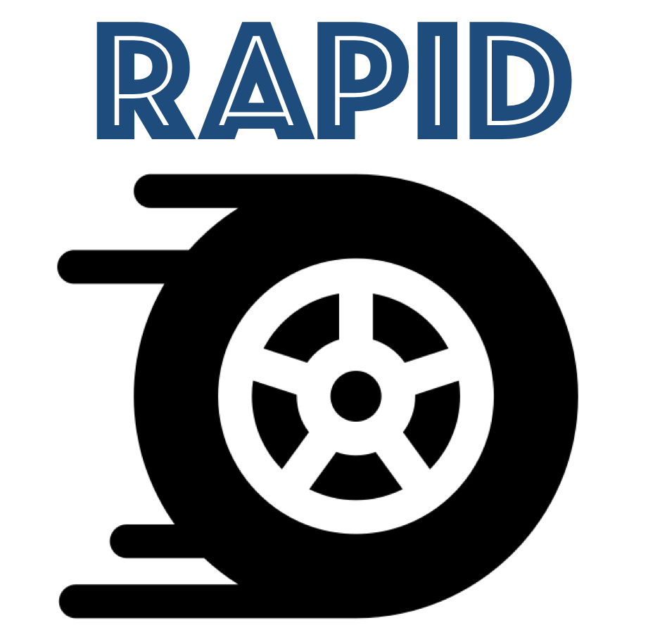

<a href="url"></a>

## RAPID : Dynamic Analysis for Concurrent Programs

RAPID is a lightweight framework for implementing dynamic race detection engines.

For the sake of simplicity, RAPID does not support its own logging mehanism but can leverage instrumentation of external tools ---  [RVPredict][2] or [RoadRunner][12] --- for logging program executions (_traces_). 
On top of this, RAPID provides functionality for reading these traces. RAPID also supports two more trace formats: CSV and STD, described below.

### Trace Formats

RAPID supports four trace formats: STD, RoadRunner, RVPredict and CSV. Traces can be read in all the three formats, and can be converted from any of the three formats to either CSV or STD format. CSV format is close to being obsolete and STD serves as a better version than CSV.

#### 1. STD (Standard) Format

Recall that a trace is a sequence of events, each of which can be seen as a record `e = <t, op(decor), loc>`, where 
* `t` is the identifier of the thread that performs `e`
* `op(decor)` represents the operation alongwith the operand. `op` can be one of `r`/`w` (read from/ write to a memory location), `acq`/`rel` (acquire/release of a lock object), `fork`/`join` (fork or join of a thread). The field `decor` is the corresponding memory location when `op` is `r`/`w`, lock identifier when `op` is `acq`/`rel` and thread identifer when `op` is `fork`/`join` .
* `loc` represents the program location corresponding to this event `e`.

The STD file format essentially represents a trace as a sequence of records, where the above three fields are separated by a `|`. A sample STD file looks something like:
```
T0|r(V123)|345
T1|w(V234.23[0])|456
T0|fork(T2)|123
T2|acq(L34)|120
T2|rel(L34)|130
T0|join(T2)|134

```
which represents a trace containing 6 events, performed by 3 different threads (`T0`,`T1`,`T2`). The 1st event is a read event on memory location `V123` performed by thread `T0`. The 2nd event is a write on memory location `V234.23[0]` by thread `T1`.
The 3rd event is performed by thread `T0` and forks thread `T2`.
The 4th event is an acquire event of lock `L34` in thread `T2`.
The 5th event release lock `L34` in thread `T2`.
The 6th event joins thread `T2` in the parent thread `T0`.


#### 2. RoadRunner Format

See [here](notes/Generate_RoadRunner_traces.md).


#### 3. RVPredict Format
[RVPredict][2] is a commercial product of [Runtime Verification Inc][3], and performs an SMT based analysis for predicting data races dynamically. RVPredict instruments Java bytecode and is able to perform dynamic analysis on the traces, at runtime. Additionally, it also provides the facility to log the trace generated to perform offline analysis on the logged traces. The developers of RVPredict have kindly shared with us (developers of RAPID) code snippets used to decode these compressed binary traces. As a result,
RAPID can analyze traces generated by RVPredict’s logging feature.
Thanks to the execellent features provided by RVPredict, the development of our dynamic analysis engines could be carried on without worrying about the details of instrumentation, which can be really cumbersome. Besides, this also allowed us to compare against RVPRedict's performance.

**Download** : 
~~The academic version of RVPredict can be downloaded here [here](https://runtimeverification.com/predict/download/?v=1.8.4).~~
The version of RVPredict that allows us to log traces can be found [here](https://uofi.box.com/v/rvpredict).

**Generating RVPredict Logs** : After obtaining a licensed copy of RVPredict, one can execute the following command to generate log files :

```
$ /path/to/rv-predict --log --base-log-dir /some/directory --log-dirname somename -cp /path/to/jar main.Class
```
where 
* `/path/to/rv-predict` is the path to the script provided by RVPredict tool, often found in the folder `RV-Predict/bin`
* `/some/directory/somename` specifies the path where the log files will be stored
* `main.Class` specifies the path to the class that implements the `main` function
* `-cp /path/to/jar` is an optional parameter to specify the classpath to locate the class `main.Class`

Executing the above command produces several log files with extension `.bin` in the directory `/some/directory/somename`. Each such `.bin` file corresponds to the projection of the actual execution onto some specific thread. In addition, the directory also contains, amongst other files, the file `metadata.bin`. This file contains information on how to map events in the trace logs to actual program locations and variables in the source code.

Alternatively, RVPredict can also be run as a java-agent in the following manner :
```
java -cp /path/to/jar -javaagent:/path/to/rv-predict.jar="--log --base-log-dir /some/directory --log-dirname somename" main.Class
```

**Extracting metadata**
The contents of the file `metadata.bin` can be extracted as follows :
```
java -cp /path/to/rv-predict.jar com.runtimeverification.rvpredict.util.ReadLogFile /path/to/metadata.bin
```

Since the source code for RVPredict is proprietary. The code snippets shared by RVPredict developers have been obscured and provided as external jar libraries.

More documentation about RV-Predict is available [here][4].


#### 4. CSV (Comma-Separated-Values) Format

A CSV file represents a valid trace if
* the number of lines in the file is equal to the number of events in the trace,
* each of the lines has the same number of columns (= number of commas + 1), which is also the number of threads in the trace.
* in each line, exactly one column is populated, and is of the form `op(decor)`, similar to the middle field in the STD format. The index of the populated column corresponds to a unique thread.

The CSV equivalent of the above trace is givn below :
```
r(V123),,
,w(V234.23[0]),
fork(T2),,
,,acq(L34)
..rel(L34)
join(T2),,
```

### RAPID Architecture

RAPID has been designed to enable researchers to quickly implement and evaluate their dynamic analysis techniques. As a result, the architecture of RAPID has been kept at bare-bones minimum, so that it is simple and easy to understand.
So far, the focus has not been on performance optimality.

**Engine** - The main interesting class that RAPID implements is the `Engine` class.
`Engine` is an abstract class, and can be inherited to implement different dynamic analysis engines. 
The current distribution includes the following race detection engines :
1. [DJIT+][5] style HB race detection (see [`engine.racedetectionengine.hb`](src/engine/racedetectionengine/hb))
2. HB race detection with [FastTrack][6] style epoch optimizations (see [`engine.racedetectionengine.hb_epoch`](src/engine/racedetectionengine/hb_epoch))
3. HB race detection using [Goldilocks][7] algorithm (see [`engine.racedetectionengine.goldilocks`](src/engine/racedetectionengine/goldilocks))
4. [Eraser's algorithm][8] for violation of lockset principle (see [`engine.racedetectionengine.lockset`](src/engine/racedetectionengine/lockset))
5. DJIT+ style HB race detection which [forces an order between each race detected][9] (see [`engine.racedetectionengine.fhb`](src/engine/racedetectionengine/fhb)) 
6. Race Detection using the [SHB][9] partial order (see [`engine.racedetectionengine.shb`](src/engine/racedetectionengine/shb))
7. Race detection using the [SHB][9] partial order with epoch optimization (see [`engine.racedetectionengine.shb_epoch`](src/engine/racedetectionengine/shb_epoch))
8. Race detection using [WCP][1] partial order ([`engine.racedetectionengine.wcp`](src/engine/racedetectionengine/wcp))
9. Race detection for [Sync-Preserving Races][13] ([`engine.racedetectionengine.syncpreserving`](src/engine/racedetectionengine/syncpreserving))
10. [Velodrome][10] algorithm for detecting atomicity violations (see [`engine.atomicity.conflictserializability.velodrome`](src/engine/atomicity/conflictserializability/velodome))
11. [Aerodrome][11] algorithm for detecting atomicity violations (see [`engine.atomicity.conflictserializability.aerodrome_basic`](src/engine/atomicity/conflictserializability/aerodrome_basic) for the basic algorithm and [`engine.atomicity.conflictserializability.aerodrome`](src/engine/atomicity/conflictserializability/aerodrome/) for Aerodrome with optimizations)

The above packages also give a fair idea on how to write your favorite dynamic analysis engine in RAPID.

**Generic Utilities** - For implementing dynamic analysis engines, one might use sophisticated data structures, such as vector clocks (VC), adaptive VCs (_epoch_), etc. We have implemented popular ones in the package `util`, and these are being used in some race detection engines.

**Parsing Utilities** - The parsing functions for reading traces in the three formats RVPredict, CSV, STD are implemented in `parse` package. The parsing utilities for RVPredict format have been obfuscated and have been provided only as jar files

### Conversion across Trace Formats

RAPID supports reading files specified in RoadRunner, STD, RVPredict or CSV format. RAPID also allows printing a given trace into either STD or CSV format.

[1]: https://dl.acm.org/citation.cfm?id=3062374
[2]: https://runtimeverification.com/predict/
[3]: https://runtimeverification.com/
[4]: https://runtimeverification.com/predict/1.8.3/docs/
[5]: https://dl.acm.org/citation.cfm?id=781529
[6]: https://dl.acm.org/citation.cfm?id=1542490
[7]: https://dl.acm.org/citation.cfm?id=1250762
[8]: https://dl.acm.org/citation.cfm?id=265927
[9]: https://dl.acm.org/citation.cfm?id=3276515
[10]: https://dl.acm.org/citation.cfm?id=1375618
[11]: https://dl.acm.org/doi/10.1145/3373376.3378475
[12]: https://github.com/stephenfreund/RoadRunner/
[13]: http://umathur3.web.engr.illinois.edu/papers/sync-preserving-race-popl2021.pdf

___
Rapid icon made by <a href="https://www.flaticon.com/authors/freepik" title="Freepik">Freepik</a> from <a href="https://www.flaticon.com/" title="Flaticon"> www.flaticon.com</a>
